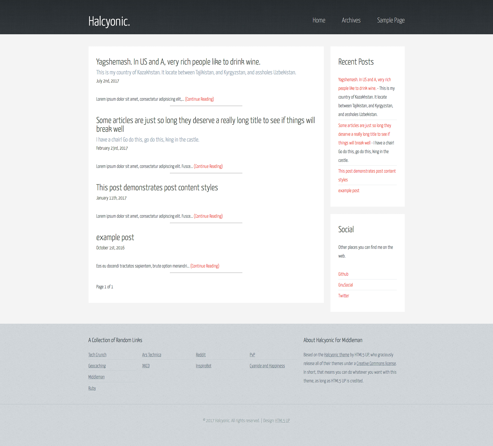
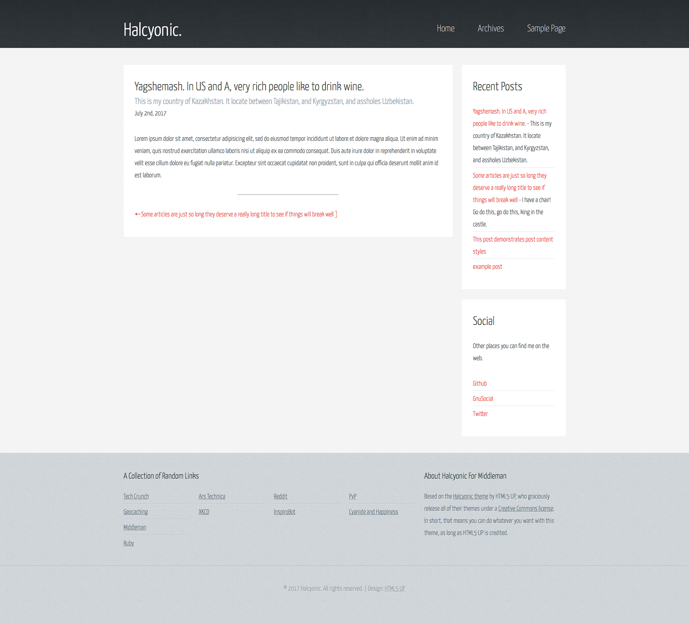
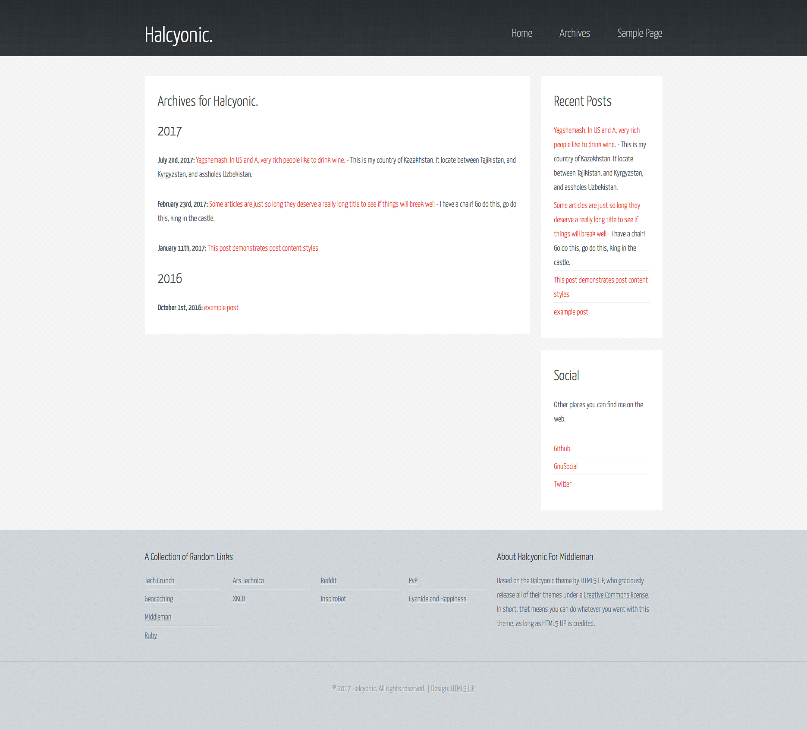
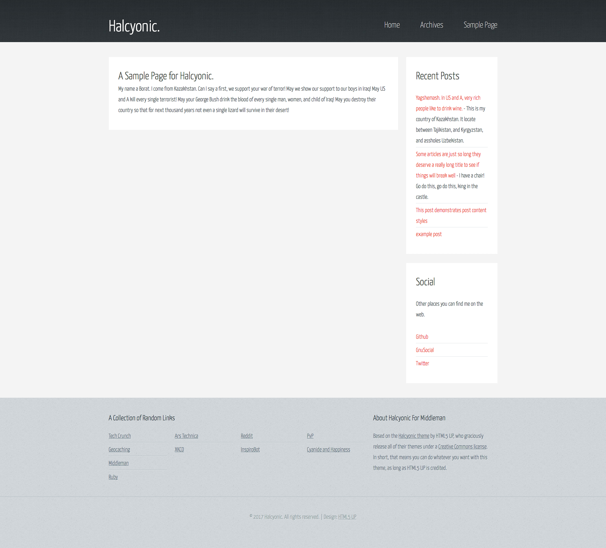

# Halcyonic - An HTML5 Up theme for [Middleman](https://middlemanapp.com)

Halcyon for [Middleman](https://middlemanapp.com) is a clean, simple theme based on the 2-column layout (sidebars on the right) of the HTML5 Up theme of [the same name](https://html5up.net/halcyonic).  
Creation of the theme was another exercise in learning to create themes totally from scratch.  
As such, I made the theme (mostly) modular, so that pretty much any section of the theme can be easily edited (*or removed from the layout entirely*).  
The top navigation menu, social links are configured in `pelicanconf.py` as is the norm.  
The footer (*and the links and blurb therein*) are partials and can be edited separately or removed from the layout.  


Something that seems to be unique (or at the very least, *uncommon*) to my themes/modification of themes is that the dates are English Ordinal (e.g., "June 1st, 2017"), accomplished with the "facets" gem and a simple config helper.

I still suck at coding, so the links at the bottom of the page is done with a horribly hackish read of separate yaml data files instead of one very nested yaml file. However, I suppose this could be a better way if you don't want 4 columns of links (or want more than 4...).


## Posts


### Markdown
```markdown
---
title: Man In The Middle
subtitle: Totally optional
date: 1999-12-31
tags: middleman, party
---

Lorem ipsum dolor sit amet, consectetur adipisicing elit, sed do eiusmod
tempor incididunt ut labore et dolore magna aliqua. Ut enim ad minim veniam,
quis nostrud exercitation ullamco laboris nisi ut aliquip ex ea commodo
consequat. Duis aute irure dolor in reprehenderit in voluptate velit esse
cillum dolore eu fugiat nulla pariatur. Excepteur sint occaecat cupidatat non
proident, sunt in culpa qui officia deserunt mollit anim id est laborum.
```

## Screenshots

### Main


### Single Article


### Archives


### Sample Page



#### Original README
Halcyonic by HTML5 UP
html5up.net | @ajlkn
Free for personal and commercial use under the CCA 3.0 license (html5up.net/license)


A somewhat unusual but interesting responsive site template. I did this one to test out a
new pattern set I put together and I think it really came together well. As for use cases
it's kind of unspecific so hey, use it for whatever.

Feedback, bug reports, and comments are not only welcome, but strongly encouraged :)

AJ
aj@lkn.io | @ajlkn


Credits:

    Demo Images:
        Unsplash (unsplash.com)

    Other:
        jQuery (jquery.com)
        html5shiv.js (@afarkas @jdalton @jon_neal @rem)
        Respond.js (j.mp/respondjs)
        Skel (skel.io)
        

[1]: 
[2]: 
